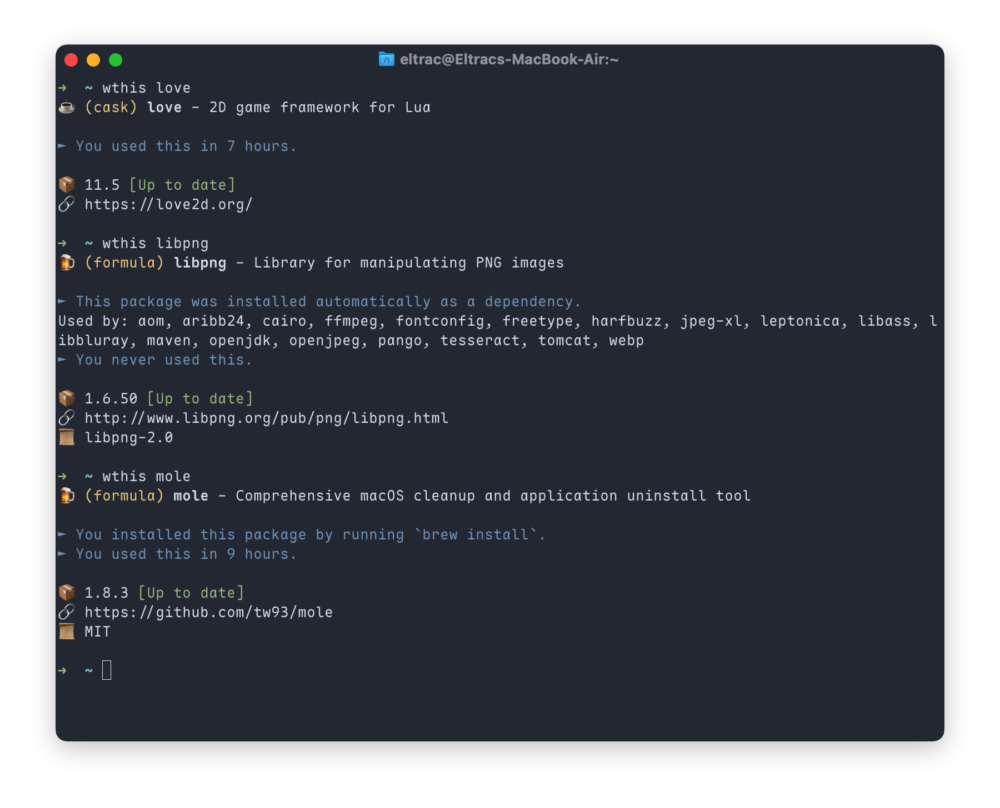

# wthis

A CLI tool to fetch information about a Homebrew formulae or cask. `wthis` stands for "What the heck is ...?"

Personally, I like having full control over my computer. Deleting apps from macOS is easy but there are lots of things in my `brew list` that I have no idea how they got there! `wthis` help you understand how a formulae/cask is installed (on request or automatically as a dependency), what other formulae uses it, and how recently you used it, so you know if you can safely remove it or at least feel comfortable about keeping it!

## Installation

```shell
brew install BigCoke233/tap/wthis
```

## Usage

```shell
wthis <formulae_or_cask_name>
```
